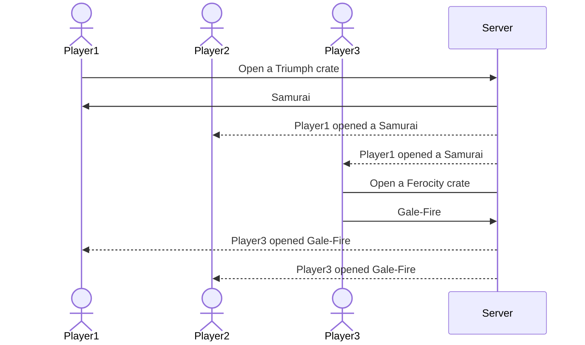

# Rocket League Crate Simulator

[My Notes](notes.md)

A mimicry of Rocket League's old crate opening system where a user earns one of many crates by playing the game, then may opt to purchase keys for $1 each in order to open any crate of choice. The crate then returns a random item. The probabilities are decided by each item's rarity.

Site: http://timmyr.click

HTML:
HTML links index (Home), play (Play), and scoreboard (Scoreboard) pages. Index is a simple login page requiring a username and password. Play is where the crates are selected, amount is chosen, and session total for each rarity is displayed. It also shows live updates on what other players have pulled from their crates. Scoreboard displays the totals for each username and each of their crate rarities opened. Placeholder image is set, and deployFiles exist.

CSS:
CSS creates a gradient background, places objects in a flex position, and in a grid on play.html. Everything is ordered properly on play.html in their respective grid boxes. Scoreboard table is centralized and allows reading it to be clear and easy. Bootstrap makes an identical and clean looking header and footer across all pages. Header includes project title and logo, which link back to the home page, and both header and footer link to all other pages, including github. Resizing the page isn't perfect, but works rather well for all devices and lets them all be properly functionable. All future pictures that will be used are now available.

React 1:
Converted things as best I could to .jsx files instead of .html. I kept them for reference, but they are not used in anything. My main issues involve the header and footer always being fickle, and I regret mixing so much Bootstrap with CSS. Overall, the project is fully functional on all devices, but breaks when put to the extremes. Everything works as intended.

React 2:
Added live updates to the opening of crates. Password does not matter, only username is needed, and it attatches a personal tracker to the user. Any opened crate is stored in the scoreboard map as well as showing the most recent openings and the just opened crate. Scoreboard updates live locally and displays the amount of opened crates in a descending order of amount opened. Events update the recent opening, the scoreboards, swap the crate image depending on which crate is selected, and allows for multiple opening button to reveal a slider which determines how many crates to open at once. Logging in also directs the user automatically to the play screen.

Service:
Backend will now be the one opening crates using /api/open-crate. Also added a button that will show the username when logged in and enables them to log out as well. Adjusted the header to account for this. Allowed local storage to hold data for user accounts and verifies when users enter proper credentials or create a new account. Now has fluid frontend-backend communication, where the backend now handles crate openings, and the authentication system dynamically updates the UI based on user status.

DB/Login:
All data storage is now handled by MongoDB.The frontend updates between each opening of 'multiple cases' instead of once at the end of all of them. Guest data is not stored in the database, although they can access the rest of the program. Signing in hashes the credentials to maintain security as well. Also added a function I can call to wipe the leaderboard entirely. 

Websocket:
The WebSocket connection is initialized when the user lands on the play page, and automatically disconnects when the page is closed or refreshed. WebSocket now successfully connects all users in real-time. When a crate is opened, a message is broadcast containing the username, item name, and rarity. This is displayed on the global feed for all users. Messages are parsed from JSON and routed through client-side handlers. Each user also sees their own most recent crate in the "just opened" section. Guests can open crates and participate in the global feed, but their data is not persisted to the leaderboard. 

<!-- Crate items & rarities
Accelerator
(Rare) Pearlescent (Matte)
(Rare) Critters
(Rare) Splatter
(Rare) Chainsaw
(Rare) Gigapede
(Very Rare) Gaiden
(Very Rare) Hot Rocks
(Very Rare) Lightning
(Import) Jäger 619
(Import) Power-Shot
(Import) Saptarishi
(Import) Snakeskin
(Exotic) Clockwork
(Exotic) Chrono
(Black Market) Party Time
(Black Market) Fireworks
(Black Market) Hellfire
(Black Market) Popcorn

Impact
(Rare) Staredown
(Rare) Splashback
(Rare) Windswept
(Rare) Sundae
(Very Rare) Masato
(Very Rare) Burnout
(Very Rare) Migraine
(Very Rare) Reaper
(Import) Twinzer
(Import) Enchanter
(Import) Cirrus
(Exotic) Santa Fe
(Exotic) Centro
(Black Market) Atomizer
(Black Market) Juiced
(Black Market) Fire God
(Black Market) Streamline

Turbo
(Rare) Heiwa
(Rare) Kawaii
(Rare) Griffon
(Rare) Suji
(Rare) Aqueous
(Very Rare) Snakeskin
(Very Rare) Xenosplash
(Very Rare) Septem
(Very Rare) Vector
(Import) Furry
(Import) Tachyon
(Import) Endo
(Exotic) Roulette
(Exotic) Kalos
(Black Market) 20XX
(Black Market) Biomass
(Black Market) Hexed
(Black Market) Tora

Vindicator
(Rare) Abtruse
(Rare) Ouchie
(Rare) Edge Burst
(Rare) Clodhopper
(Rare) OR-AISE
(Very Rare) Picket
(Very Rare) Truncheon
(Very Rare) Kana
(Import) Apparatus
(Import) Sentinel
(Import) Ninja Star
(Exotic) NeYoYo
(Exotic) Creeper
(Black Market) Shattered
(Black Market) Glorifier
(Black Market) Neuro-Agitator
(Black Market) Intrudium

 -->

> [!NOTE]
<!-- >  This is a template for your startup application. You must modify this `README.md` file for each phase of your development. You only need to fill in the section for each deliverable when that deliverable is submitted in Canvas. Without completing the section for a deliverable, the TA will not know what to look for when grading your submission. Feel free to add additional information to each deliverable description, but make sure you at least have the list of rubric items and a description of what you did for each item.

> [!NOTE]
>  If you are not familiar with Markdown then you should review the [documentation](https://docs.github.com/en/get-started/writing-on-github/getting-started-with-writing-and-formatting-on-github/basic-writing-and-formatting-syntax) before continuing. -->

## 🚀 Specification Deliverable

> [!NOTE]
>  Fill in this sections as the submission artifact for this deliverable. You can refer to this [example](https://github.com/webprogramming260/startup-example/blob/main/README.md) for inspiration.

For this deliverable I did the following. I checked the box `[x]` and added a description for things I completed.

- [X] Proper use of Markdown
- [X] A concise and compelling elevator pitch - short, sweet, and to the point
- [X] Description of key features - I'm certain this list will change as I get more into the project
- [X] Description of how you will use each technology - I'm unsure of how accurately my uses are, this will likely be updated later on
- [X] One or more rough sketches of your application. Images must be embedded in this file using Markdown image references.

### Elevator pitch

As a big Rocket League enjoyer, I was rather distraught when Epic Games bought out Psyonix and changed the crate system to blueprints. Consequently the prices of the more expensive items skyrocketed rather than being worth the $1 key that you spent to open the crate. Although unable to return to those prime days of obtaining in-game items and decals, we can simulate opening crates to mimic the rush felt by opening the crates through a simple website.

### Design
Diagram of how a server request to open a crate returns the item to the player and notifies other players.

### Key features

- HTTPS login
- Multiple crates to choose from
- All items opened by other players live is shown
- Scoreboard totals for each rarity per player 
- Several selectors/options that allow for a personalized game

### Technologies

I am going to use the required technologies in the following ways.

- **HTML** - Login, opening crate, scoreboard
- **CSS** - Create a clean look for all, with emphasis on opening page
- **React** - Affirms login, opens crate, allows for selections on menus
- **Service** - Backend service to update public recent openings live, calculate what each opened item will be
- **DB/Login** - Login registry and temporary public openings
- **WebSocket** - When finalized, the opened item is shown to all players

## 🚀 AWS deliverable

For this deliverable I did the following. I checked the box `[x]` and added a description for things I completed.

- [X] **Server deployed and accessible with custom domain name** - [My server link](https://timmyr.click).

## 🚀 HTML deliverable

For this deliverable I did the following. I checked the box `[x]` and added a description for things I completed.

- [X] **HTML pages** - I did complete this part of the deliverable - All 3 pages are set up nicely
- [X] **Proper HTML element usage** - I did complete this part of the deliverable - Plenty of separators are used to make adding id and classes easy when doing css later on
- [X] **Links** - I did complete this part of the deliverable - Links to all pages and GitHub are present
- [X] **Text** - I did complete this part of the deliverable - Text is evident to provide clarity
- [X] **3rd party API placeholder** - I did complete this part of the deliverable.
- [X] **Images** - I did complete this part of the deliverable - One image is currently there. Just a placeholder for now
- [X] **Login placeholder** - I did complete this part of the deliverable - Username and Password inputs don't yet function, but exist
- [X] **DB data placeholder** - I did complete this part of the deliverable - Scoreboard will hold DB info
- [X] **WebSocket placeholder** - I did complete this part of the deliverable - play.html will display live info

## 🚀 CSS deliverable

For this deliverable I did the following. I checked the box `[x]` and added a description for things I completed.

- [X] **Header, footer, and main content body** - I did complete this part of the deliverable.
- [X] **Navigation elements** - I did complete this part of the deliverable.
- [X] **Responsive to window resizing** - I did complete this part of the deliverable.
- [X] **Application elements** - I did complete this part of the deliverable.
- [X] **Application text content** - I did complete this part of the deliverable.
- [X] **Application images** - I did complete this part of the deliverable.

## 🚀 React part 1: Routing deliverable

For this deliverable I did the following. I checked the box `[x]` and added a description for things I completed.

- [X] **Bundled using Vite** - I did complete this part of the deliverable.
- [X] **Components** - I not complete this part of the deliverable.
- [X] **Router** - Routes between all three pages

## 🚀 React part 2: Reactivity

For this deliverable I did the following. I checked the box `[x]` and added a description for things I completed.

- [?] **All functionality implemented or mocked out** - I maybe did complete this part of the deliverable. I'm not too sure what this is asking.
- [X] **Hooks** - I did complete this part of the deliverable.

## 🚀 Service deliverable

For this deliverable I did the following. I checked the box `[x]` and added a description for things I completed.

- [X] **Node.js/Express HTTP service** - I did complete this part of the deliverable.
- [X] **Static middleware for frontend** - I did complete this part of the deliverable.
- [X] **Calls to third party endpoints** - I did complete this part of the deliverable.
- [X] **Backend service endpoints** - I did complete this part of the deliverable.
- [X] **Frontend calls service endpoints** - I did complete this part of the deliverable.

## 🚀 DB/Login deliverable

For this deliverable I did the following. I checked the box `[x]` and added a description for things I completed.

- [X] **User registration** - I did complete this part of the deliverable.
- [X] **User login and logout** - I did complete this part of the deliverable.
- [X] **Stores data in MongoDB** - I did complete this part of the deliverable.
- [X] **Stores credentials in MongoDB** - I did complete this part of the deliverable.
- [X] **Restricts functionality based on authentication** - I did complete this part of the deliverable.

## 🚀 WebSocket deliverable

For this deliverable I did the following. I checked the box `[x]` and added a description for things I completed.

- [X] **Backend listens for WebSocket connection** - I did complete this part of the deliverable.
- [X] **Frontend makes WebSocket connection** - I did complete this part of the deliverable.
- [X] **Data sent over WebSocket connection** - I did complete this part of the deliverable.
- [X] **WebSocket data displayed** - I did complete this part of the deliverable.
- [X] **Application is fully functional** - I did complete this part of the deliverable.